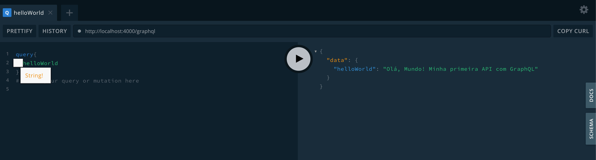

# 🌐 Hello World usando GraphQL

Bem-vindo ao projeto **Hello World usando GraphQL**! Este repositório foi criado com o propósito de **praticar e aprender mais sobre GraphQL** de forma estruturada e divertida. 🚀

## 📋 Propósito

- Aprender os conceitos básicos de GraphQL.
- Praticar a criação de APIs utilizando GraphQL.
- Explorar boas práticas no desenvolvimento com GraphQL.

## 📦 Dependências

Este projeto utiliza as seguintes dependências:

- **[Node.js](https://nodejs.org/)** - Ambiente de execução JavaScript.
- **[Express](https://expressjs.com/)** - Framework web para Node.js.
- **[GraphQL](https://graphql.org/)** - Linguagem de consulta para APIs.
- **[Apollo Server](https://www.apollographql.com/docs/apollo-server/)** - Servidor GraphQL para Node.js.

## 🚀 Bora começar !!!

Para dar início siga os seguintes passos abaixo:

1. Clone este repositório.
2. Acesse a pasta onde o repositório foi clonado.
3. Instale as dependências com `npm install`.
4. Inicie o servidor com `npm start`.
5. Após isso será possível acessar a API através do endereço `http://localhost:4000/graphql` utilizando a seguinte query:

`query { helloWorld }`

O resultado dessa query será o seguinte:

Essa foi o commit inicial do aprendizado sobre graphql com Nodejs.
